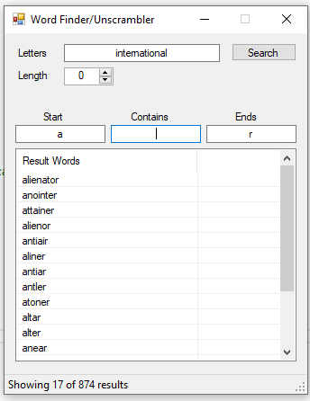

# Word Finder/Unscrambler

A lightweight Windows Forms application built with C# and .NET Framework that allows users to find and unscramble words from a set of letters by leveraging the **fly.wordfinderapi.com** service.

## Features

* **API Integration**: Connects to the `fly.wordfinderapi.com` endpoint to fetch accurate word matches.
* **In-Memory Processing**: Processes and stores data entirely in memory for high performance and privacy—no local result files are created.
* **Real-Time Filtering**: Includes a search-as-you-type filter that narrows down results locally without additional API calls.
* **User Feedback**: Displays live counts of total results found and currently visible results.

## Getting Started

### Prerequisites

* **Visual Studio** (2019 or later recommended).
* **.NET Framework** (4.7.2 or higher recommended).

### Installation

1.  Clone the repository to your local machine.
2.  Open the solution file (`.sln`) in Visual Studio.
3.  **Required NuGet Packages**:
    You must install `System.Text.Json` via NuGet to handle JSON deserialization.
4.  **Project References**:
    Ensure `System.Web` is included in your project references to support the `HttpUtility` class used for API query strings.

## How to Use

1. **Enter Letters**: Type your available letters into the main input box.
2. **Search**: Click "Search" or press **Enter**. The app will fetch results from `fly.wordfinderapi.com`.
3. **Advanced Filtering**: 
   * **Starts With**: Type in `textStarts` to find words beginning with specific letters.
   * **Ends With**: Type in `textEnds` to find words ending with specific letters.
   * **Contains**: Use the general filter to find words containing specific sequences.
   * *Filters apply automatically after a search or as you type.*
     

  

